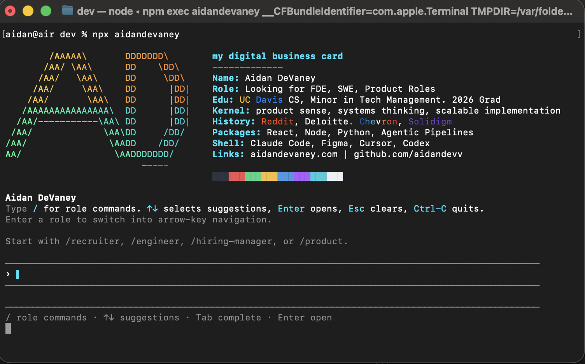
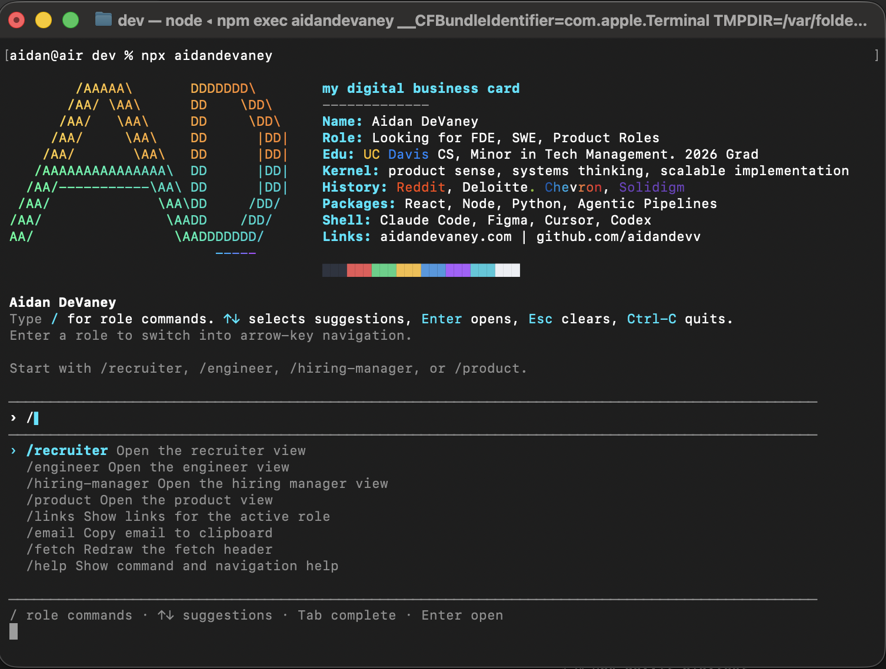
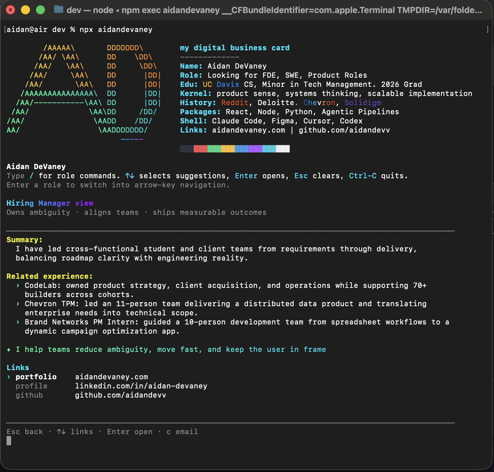

# npm-domains

npm namespace packages for the **Aidan Devaney** brand — claimed, published, and parked on the npm registry.

---

## ✨ Try it

```bash
npx aidandevaney
```

Interactive terminal card — `↑↓` to navigate links, `↵` to open in browser, `c` to copy email, `q` to quit.







---

## Packages

| Package | Status | Registry |
|---|---|---|
| [`aidandevaney`](packages/aidandevaney) | 🟢 Active | [npmjs.com/package/aidandevaney](https://www.npmjs.com/package/aidandevaney) |
| [`aidan-dev`](packages/aidan-dev) | 🅿️ Parked | [npmjs.com/package/aidan-dev](https://www.npmjs.com/package/aidan-dev) |
| [`hire-aidan`](packages/hire-aidan) | 🅿️ Parked | [npmjs.com/package/hire-aidan](https://www.npmjs.com/package/hire-aidan) |
| [`aidan-cli`](packages/aidan-cli) | 🅿️ Parked | [npmjs.com/package/aidan-cli](https://www.npmjs.com/package/aidan-cli) |
| [`@aidandev/aidan`](packages/@aidandev/aidan) | 🅿️ Parked | [npmjs.com/package/@aidandev/aidan](https://www.npmjs.com/package/@aidandev/aidan) |
| [`@aidandev/core`](packages/@aidandev/core) | 🅿️ Parked | [npmjs.com/package/@aidandev/core](https://www.npmjs.com/package/@aidandev/core) |
| [`@aidandev/cli`](packages/@aidandev/cli) | 🅿️ Parked | [npmjs.com/package/@aidandev/cli](https://www.npmjs.com/package/@aidandev/cli) |
| [`@aidandev/aidandev`](packages/@aidandev/aidandev) | 🅿️ Parked | [npmjs.com/package/@aidandev/aidandev](https://www.npmjs.com/package/@aidandev/aidandev) |
| `aidan` | 🚫 Blocked | Too similar to existing package `livan` |
| `aidandev` | 🚫 Blocked | Too similar to `aidan-dev` — appeal submitted |
